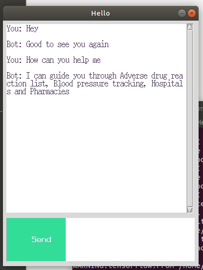

# python_chatbot
Given a set of classes = {'greeting', 'remember', 'goodbye', 'thanks', 'noanswer', 'options', 'adverse drug', 'blood pressure', ..}
each class has certain number of questions and answers .
Given sentences it maps them to classes
When user enters any input it converts them vector and and finds the most similar class, and return random answer from that class.

